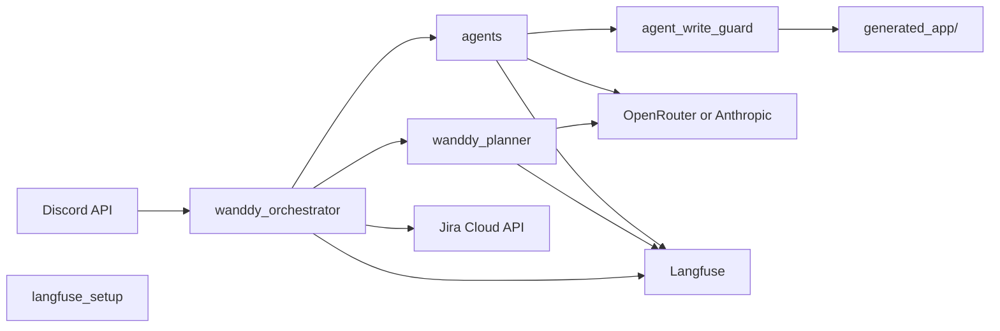

# Wanddy demo — Discord orchestrator with Langfuse

**Public demo only — not production-ready.** This repo is published for **education, experimentation, and controlled pilots**. It is **not** a hardened product: expect gaps in reliability, security review, observability beyond Langfuse, multi-tenant isolation, and operational runbooks. **Do not** treat it as drop-in infrastructure for regulated, high-traffic, or business-critical use until you add your own production standards (see [Limitations and UAT](#limitations-and-uat)).

**No responsibility — Jigar Joshi and Wan Buffer Services.** **Jigar Joshi** and **Wan Buffer Services** accept **no responsibility or liability** for this code or your use of it (including indirect or consequential damages, data loss, security incidents, regulatory exposure, or business interruption). This project is provided **as-is**; any use is **at your sole risk**. The [Unlicense](LICENSE) applies to the software; this notice is an additional clarification regarding named parties.

Python utilities that watch a Discord orchestrator channel, optionally create Jira issues, run a **planner** LLM step (traced in [Langfuse](https://langfuse.com)), and on user **approve** run a sequential multi-agent chain that writes scaffold code under [`generated_app/`](generated_app/README.md). The repo includes **one committed sample** (`doctor-appointment-booking-system/`) as illustration; other generated slugs stay gitignored by default.

## Architecture

- **`wanddy_presence.py`** — WebSocket gateway presence so the bot shows online.
- **`wanddy_orchestrator.py`** — One polling iteration: scan channel, open threads, Jira placeholder, planner, handle replies (`approve` / `modify` / `reject`), run agent chain when approved.
- **`wanddy_planner.py`** — Planner LLM call (OpenRouter or Anthropic), Langfuse-traced.
- **`agents.py`** — Role-based LLM “agents” with file-write envelope for the developer role.
- **`langfuse_setup.py`** — Langfuse + OpenRouter (OpenAI-compatible) client setup.
- **`agent_write_guard.py`** — Rules for LLM file writes under `generated_app/` (testable without Langfuse).
- **`generated_app/`** — Agent output directory; includes sample **`doctor-appointment-booking-system/`** (.NET 9 API + Vite React 18). See [`generated_app/README.md`](generated_app/README.md).



## Prerequisites

- **Python 3.10+** (required for orchestrator scripts; CI tests 3.10 and 3.12).
- A **Discord bot** token with permission to read/post in the orchestrator channel and manage threads.
- **Jira Cloud**: site, project key, cloud ID, API token + email (for issue creation via REST).
- **Langfuse** project (public + secret key, correct region URL).
- **OpenRouter** and/or **Anthropic** API key for real LLM calls (otherwise the planner uses a stub).
- **Optional — run the committed sample app:** [.NET 9 SDK](https://dotnet.microsoft.com/download) and **Node.js/npm** for `generated_app/doctor-appointment-booking-system/` (see [generated_app/README.md](generated_app/README.md) and the sample `frontend/README.md`).

## Setup

1. Clone the repository.

2. Copy environment template and fill in secrets:

   ```bash
   cp .env.example .env
   ```

3. Install dependencies:

   ```bash
   pip install -r requirements.txt
   ```

4. Optional: MCP config for Discord (local only):

   ```bash
   cp .mcp.json.example .mcp.json
   ```

   Ensure `DISCORD_TOKEN` is exported or present in `.env` when tools read it.

5. **Claude Code (optional):** The `.claude/` folder ships commands, skills, and `hooks.json`. Hook commands call [`scripts/jira_discord_bridge/hooks.sh`](scripts/jira_discord_bridge/hooks.sh) (no-op stubs — safe to clone). Copy `settings.local.json` from your machine if needed; it is gitignored. Commit `settings.json` only if you intend to share team defaults.

## Generated output and sample app

- **Where code lands:** Approved agent runs write under `generated_app/<slug>/` (paths enforced by [`agent_write_guard.py`](agent_write_guard.py)).
- **What ships in git:** One **example** scaffold — [`generated_app/doctor-appointment-booking-system/`](generated_app/doctor-appointment-booking-system/) — so you can inspect agent-style .NET 9 + Vite React 18 layout without running the orchestrator. It is **illustrative** (generated by the agent flow), not a separately maintained product.
- **What stays local:** Other folders under `generated_app/` (e.g. new slugs from your runs) are **not** tracked by default — see [`.gitignore`](.gitignore) and [`generated_app/README.md`](generated_app/README.md).
- **Run the sample:** From the sample `frontend/` directory: `npm install` then `npm run dev`; run the API with `dotnet run` against the `.csproj` under `backend/` (details in that folder’s README files).

## Configuration

Required variables are listed in [`.env.example`](.env.example). The orchestrator **requires**:

- `DISCORD_TOKEN`, `DISCORD_ORCHESTRATOR_CHANNEL_ID`
- `JIRA_CLOUD_ID`, `JIRA_PROJECT_KEY`, `JIRA_BROWSE_BASE_URL`
- `ATLASSIAN_EMAIL`, `ATLASSIAN_API_TOKEN` (for creating issues)
- Langfuse and at least one LLM key for full behavior

`tick.sh` and `start.sh` use `set -a; source .env` so all variables are exported for child processes.

## Run

- **Presence + one orchestrator tick:** `./start.sh`
- **Single tick (e.g. cron):** `./tick.sh`
- **Stop presence daemon:** `./stop.sh`

State is stored under `.claude/agent-bus/` (see `.gitignore` for which files are excluded).

## Tests

```bash
python -m unittest discover -s tests -v
```

Tests focus on **`agent_write_guard`** (safe paths and extensions for writes under `generated_app/`). GitHub Actions runs this suite plus a **`py_compile`** pass on all tracked Python files, on **Python 3.10 and 3.12** — see [`.github/workflows/ci.yml`](.github/workflows/ci.yml). There are **no** automated integration tests against Discord, Jira, or live LLMs in CI.

## Security

- Never commit **`.env`** or real tokens. Rotate any credential that was ever exposed.
- Use least-privilege Discord and Atlassian tokens.
- **Generated code:** Only the **sample** tree `generated_app/doctor-appointment-booking-system/` is intentionally tracked; build artifacts (`node_modules/`, `bin/`, `obj/`, `dist/`, etc.) under that sample stay ignored. Everything else under `generated_app/` is ignored unless you change [`.gitignore`](.gitignore) — review before adding new slugs.
- Treat committed sample code like any demo source: scan for secrets if you fork or extend it.

## License

This project is released under the [Unlicense](LICENSE) (public domain dedication).

## Limitations and UAT

This project remains **for public demo and evaluation**, not a **production-ready** orchestration platform. It does not replace full production hardening.

- **Tests:** CI covers file-write guard rules and Python syntax only — **not** Discord, Jira, or live LLM flows.
- **Sample app:** The checked-in `doctor-appointment-booking-system/` folder shows typical agent output; it is **not** warranted as production software — validate, harden, and test yourself before real use.
- **Runtime:** Failure paths may only log to stderr; approval detection in Discord threads is keyword-based; when agents run, LLM output can create any **allowed** file types under `generated_app/` on your machine.

For real production use, add staging, broader and integration tests, monitoring, incident response, access control, and explicit operational runbooks — and perform your own security and compliance review.
