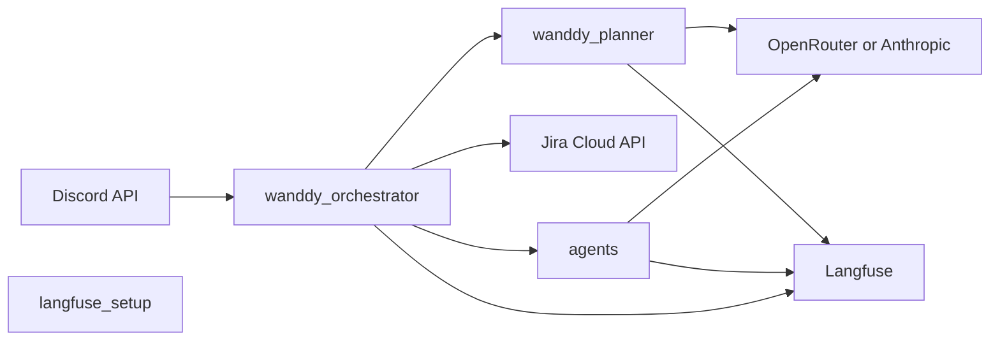

# Wanddy demo — Discord orchestrator with Langfuse

**Public demo only — not production-ready.** This repo is published for **education, experimentation, and controlled pilots**. It is **not** a hardened product: expect gaps in reliability, security review, observability beyond Langfuse, multi-tenant isolation, and operational runbooks. **Do not** treat it as drop-in infrastructure for regulated, high-traffic, or business-critical use until you add your own production standards (see [Limitations and UAT](#limitations-and-uat)).

**No responsibility — Jigar Joshi and Wan Buffer Services.** **Jigar Joshi** and **Wan Buffer Services** accept **no responsibility or liability** for this code or your use of it (including indirect or consequential damages, data loss, security incidents, regulatory exposure, or business interruption). This project is provided **as-is**; any use is **at your sole risk**. The [Unlicense](LICENSE) applies to the software; this notice is an additional clarification regarding named parties.

Python utilities that watch a Discord orchestrator channel, optionally create Jira issues, run a **planner** LLM step (traced in [Langfuse](https://langfuse.com)), and on user **approve** run a sequential multi-agent chain that can write scaffold code under `generated_app/` (ignored by git in this template).

## Architecture

- **`wanddy_presence.py`** — WebSocket gateway presence so the bot shows online.
- **`wanddy_orchestrator.py`** — One polling iteration: scan channel, open threads, Jira placeholder, planner, handle replies (`approve` / `modify` / `reject`), run agent chain when approved.
- **`wanddy_planner.py`** — Planner LLM call (OpenRouter or Anthropic), Langfuse-traced.
- **`agents.py`** — Role-based LLM “agents” with file-write envelope for the developer role.
- **`langfuse_setup.py`** — Langfuse + OpenRouter (OpenAI-compatible) client setup.
- **`agent_write_guard.py`** — Rules for LLM file writes under `generated_app/` (testable without Langfuse).



## Prerequisites

- **Python 3.10+** (test with your target version).
- A **Discord bot** token with permission to read/post in the orchestrator channel and manage threads.
- **Jira Cloud**: site, project key, cloud ID, API token + email (for issue creation via REST).
- **Langfuse** project (public + secret key, correct region URL).
- **OpenRouter** and/or **Anthropic** API key for real LLM calls (otherwise the planner uses a stub).

## Setup

1. Clone the repository.

2. Copy environment template and fill in secrets:

   ```bash
   cp .env.example .env
   ```

3. Install dependencies:

   ```bash
   pip install -r requirements.txt
   ```

4. Optional: MCP config for Discord (local only):

   ```bash
   cp .mcp.json.example .mcp.json
   ```

   Ensure `DISCORD_TOKEN` is exported or present in `.env` when tools read it.

5. **Claude Code (optional):** The `.claude/` folder ships commands, skills, and `hooks.json`. Hook commands call [`scripts/jira_discord_bridge/hooks.sh`](scripts/jira_discord_bridge/hooks.sh) (no-op stubs — safe to clone). Copy `settings.local.json` from your machine if needed; it is gitignored. Commit `settings.json` only if you intend to share team defaults.

## Configuration

Required variables are listed in [`.env.example`](.env.example). The orchestrator **requires**:

- `DISCORD_TOKEN`, `DISCORD_ORCHESTRATOR_CHANNEL_ID`
- `JIRA_CLOUD_ID`, `JIRA_PROJECT_KEY`, `JIRA_BROWSE_BASE_URL`
- `ATLASSIAN_EMAIL`, `ATLASSIAN_API_TOKEN` (for creating issues)
- Langfuse and at least one LLM key for full behavior

`tick.sh` and `start.sh` use `set -a; source .env` so all variables are exported for child processes.

## Run

- **Presence + one orchestrator tick:** `./start.sh`
- **Single tick (e.g. cron):** `./tick.sh`
- **Stop presence daemon:** `./stop.sh`

State is stored under `.claude/agent-bus/` (see `.gitignore` for which files are excluded).

## Tests

```bash
python -m unittest discover -s tests -v
```

GitHub Actions runs the same suite (and a syntax check) on Python 3.10 and 3.12 — see [`.github/workflows/ci.yml`](.github/workflows/ci.yml).

## Security

- Never commit **`.env`** or real tokens. Rotate any credential that was ever exposed.
- Use least-privilege Discord and Atlassian tokens.
- `generated_app/` is gitignored so generated code is not accidentally published; review outputs before sharing.

## License

This project is released under the [Unlicense](LICENSE) (public domain dedication).

## Limitations and UAT

This project remains **for public demo and evaluation**, not a **production-ready** orchestration platform. It does not replace full production hardening: limited automated tests (file-write rules and CI syntax checks; no full Discord/Jira/LLM integration tests in CI); failure paths may only log to stderr; approval detection is keyword-based; LLM output can write any allowed file type under `generated_app/`. For real production use, add staging, broader and integration tests, monitoring, incident response, access control, and explicit operational runbooks—and perform your own security and compliance review.
